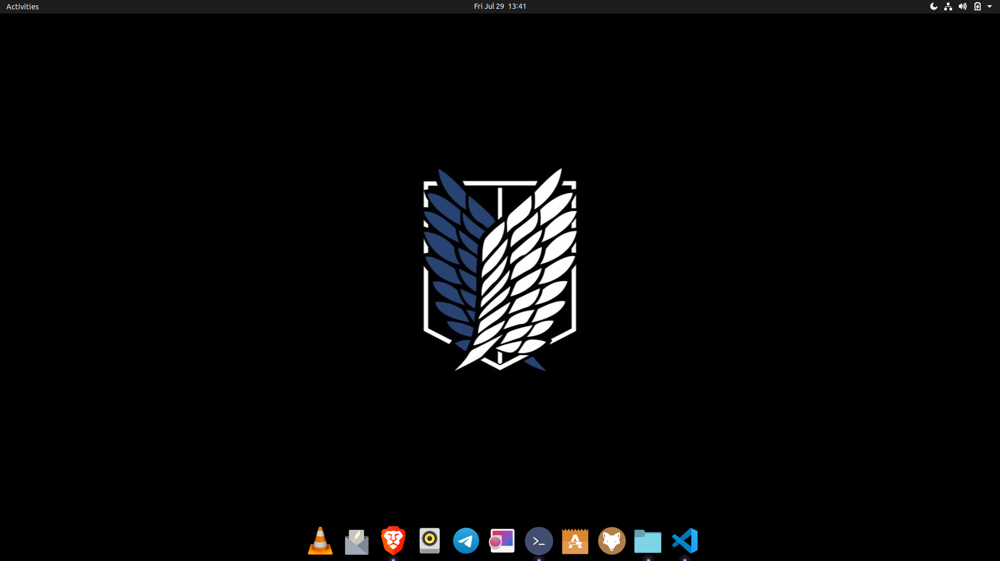

# Ubuntu-Optimization
Let's renovate our ubuntu by changing everything.

Start by opening your terminal
### 1. Installing `starship` for changing the look of our terminal

```bash
sudo snap install starship
```
Add `eval "$(starship init bash)"` in the `~/.bashrc` file.
```bash
echo 'eval "$(starship init bash)" ' >> ~/.bashrc
```
> Now exit and restart the terminal and you will see some changes

## Time for Dracula Theme

### 2. Applying dracula theme on the terminal

Installing `dconf-cli`

```bash
sudo apt-get install dconf-cli -y
```
Cloning to gnome terminal
```bash
git clone https://github.com/dracula/gnome-terminal
cd gnome-terminal
```
Let's run the installation script
```bash
./install.sh
```
**It will ask for some inputs so do the following things** 
* Press **1** and then enter
* Type **YES** and then enter
* Again press **1** and then enter.
* Similarly type **YES** and then enter.
* Finally press **2** and then enter.
Now close the terminal and relaunch it.

### 3. Applying dracula theme on `gedit`.

Download the raw file 
```bash
wget https://raw.githubusercontent.com/dracula/gedit/master/dracula.xml
```
Now make the `gedit` directory inside the `.local/share/` and inside gedit make a directory called styles move the raw file inside it.
```bash
mkdir ~/.local/share/gedit/
mkdir ~/.local/share/gedit/styles/
mv dracula.xml ~/.local/share/gedit/styles/
```
Now final step is to activate the dracula theme on `gedit`
* So now open the gedit text editor


* Now click on three lines and then click on `preferences`.


* Now click on `Fonts & Colours` and then under the `color scheme` select the `dracula` option. 


And then close the text editor and if you will relaunch it then you will see the changes.

### 4. DARK THEME FOR GDK
Download the archive file . Click below

* [Archive file](https://github.com/dracula/gtk/archive/master.zip)
* Now save it on any directory and then extract it. In my case it is saved to Downloads directory.
* go to Downloads directory in the terminal and unzip it using this command.
```bash
cd ~/Downloads/
unzip gtk-master.zip
```
* Move the `git-master` directory formed after unzipping to the `/usr/share/themes/` directory.
```bash
sudo mv ~/Downloads/gtk-master /usr/share/themes/
```
Now run the following commands and you will be able to see the changes.
```bash
gsettings set org.gnome.desktop.interface gtk-theme "Dracula"
gsettings set org.gnome.desktop.wm.preferences theme "Dracula"
```
**Now we will do the same steps for applying the icon theme:**

Download the archive file . Click below.

[Icon Archive File](https://github.com/dracula/gtk/files/5214870/Dracula.zip)

Run the following commands:

```bash
unzip Dracula.zip
```
Now move it:
```bash
sudo mv ~/Downloads/Dracula /usr/share/icons
```

### 5. Now install `gnome-tweaks` for applying all the changes.
```bash
sudo apt install gnome-tweaks -y
```

Now search for gnome-tweak using super key and open it


* Inside it go to Appearance:
* In Application, select Gtk-master.

> Note: If Application option is missing in your tweak, then search for the legacy in its search box and then select Gtk-master. 


* In Icons, change it to Dracula.
You will be able to see the changes.

> For better look, set a dark theme wallpaper.

### 6. Remove the current dock and install plank dock.

Using super key search for extensions and open it. If not available in your system, then download it from ubuntu software.


Turn off the Ubuntu dock and for better look you can turn off Desktop Icons too.


**Time for installing `PLANK`**

Open the terminal:

```bash
sudo apt-get update
sudo apt-get install plank -y
```
Now for opening plank type:
```bash
plank --preferences
```
And then customize everything according to the following images.


Now copy the whole code given below.
```bash
[Desktop Entry]
Type=Application
Exec=plank
Hidden=false
NoDisplay=false
Name[en_US]=plank
Name=plank
Comment[en_US]=plank
Comment=plank
X-GNOME-Autostart-Delay=2
X-GNOME-Autostart-enabled=true
```

Now make a file in the `.config/autostart/` directory with the name `plank.desktop` and paste the code and save it.
```bash
sudo vim ~/.config/autostart/plank.desktop
```
paste the copied code and save it.
> You can unpin and pin apps in the plank dock by first opening an app and then doing right click on its icon and changing the options

**AND EVERYTHING'S DONE** and you may notice the changes.

My ubuntu looks like this:


